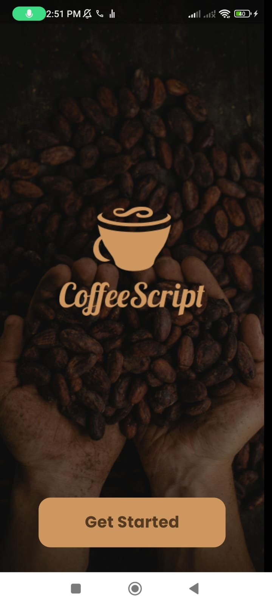
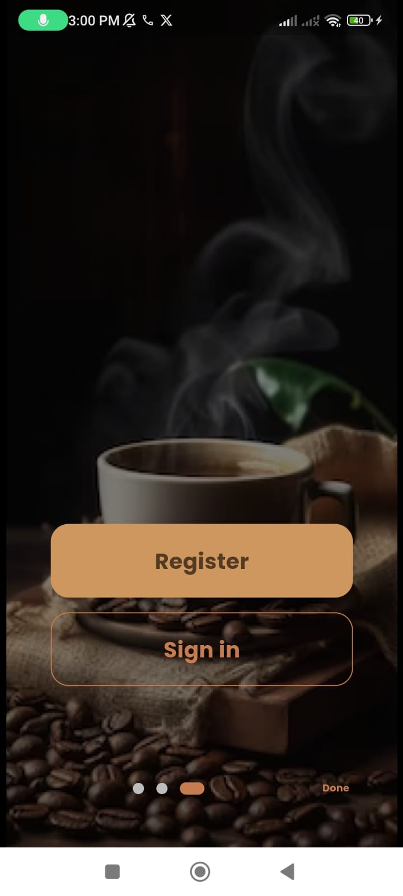
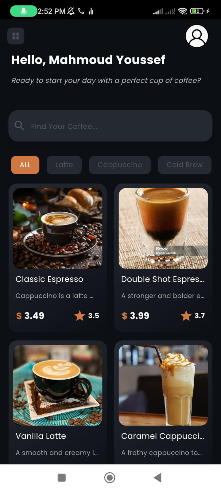
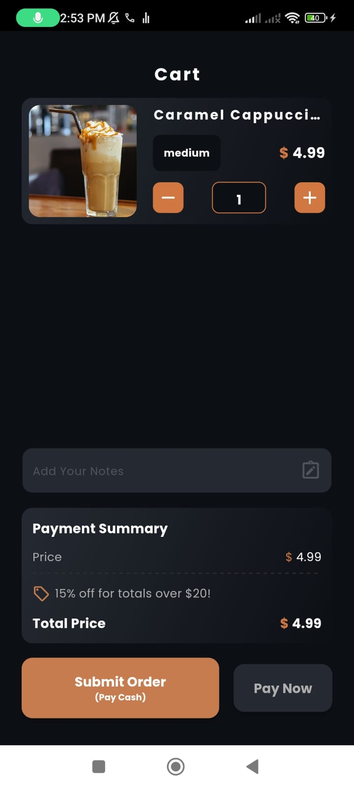
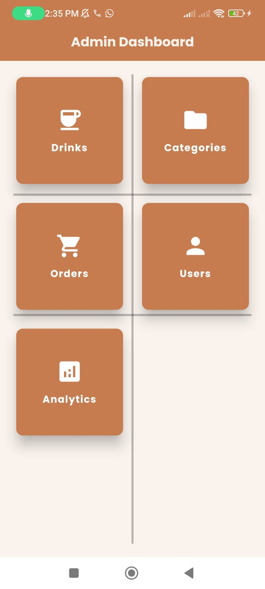
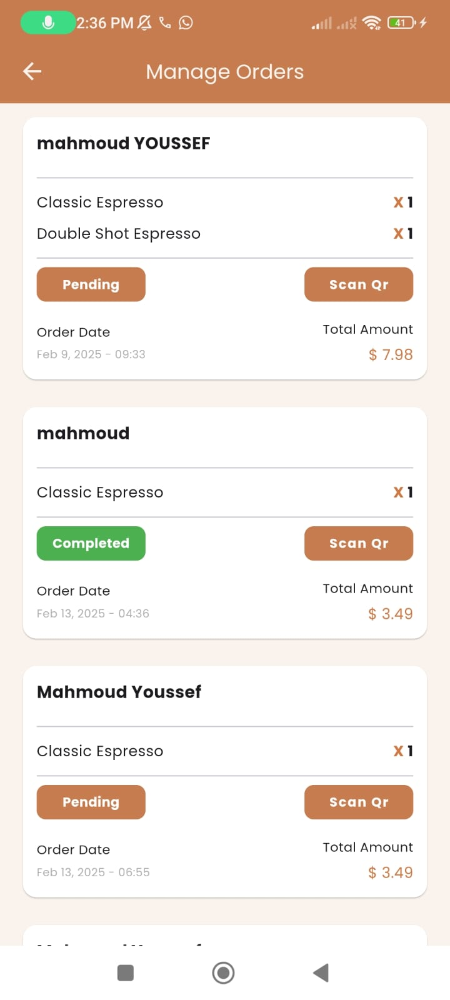
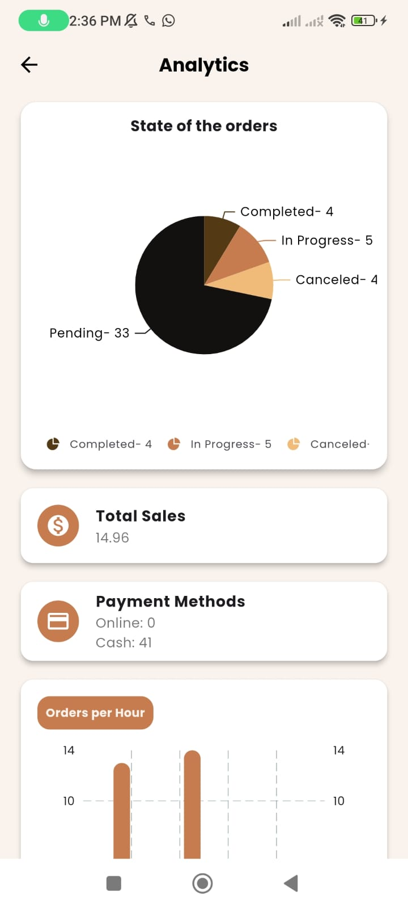

# ☕ CAFFEGO  - Coffee Shop App

A complete coffee shop application built with **Flutter** using **Clean Architecture** and **Cubit** state management. CAFFEGO provides an intuitive experience for both **users** and **admins**, integrating real-time **order tracking, payments, notifications**, and **analytics**.

### User Screens
<p align="center">
  
  
  
  

</p>

<p align="center">
  
  
  
</p>

## 🚀 Features
### 🔹 User Side
- 🛍️ Browse coffee & drinks by category
- 🛒 Add items to cart & place orders
- 💳 Pay online or with cash
- 📦 Track order status (pending, in progress, completed, canceled)
- 🔔 Receive notifications for order updates & new drinks
- ❤️ Favorite items for quick access
- 🔐 Authentication with **Firebase & Google**
- 🏆 Smooth animations & introduction screens

### Admin Screens

<p align="center">
  
  
  
</p>

### 🔹 Admin Side

- 📋 Manage drinks (add, edit, delete)
- 📂 Manage categories (add, edit, delete)
- 👥 View & manage users
- 📦 View & update order statuses
- 📊 Sales & order analytics with **graphs & flowcharts**
- 🔔 Send notifications to users for **new drinks & order updates**

## 🏗️ Tech Stack
- **Flutter** with **Clean Architecture**
- **Cubit** for state management
- **Firebase** (Auth, Firestore, FCM for notifications)
- **Hive & SharedPreferences** for local storage
- **Payment Integration** (online & cash payments)
- **QR Code Scanner** for orders
- **HTTP** for API handling
- **Animations & UI Enhancements**

## 📦 Installation
1. Clone the repository:
   ```bash
   git clone https://github.com/mahmoudyoussef3/CaffeeGo.git
   cd caffego
   ```
2. Install dependencies:
   ```bash
   flutter pub get
   ```
3. Run the app:
   ```bash
   flutter run
   ```

## 🔗 Connect with Me
📧 Email: [mahmoudyousse220@gmail.com](mailto:your-email@example.com)  
🔗 LinkedIn: [Mahmoud Youssef](https://www.linkedin.com/in/mahmoud-youssef-863b3b21a/)

---
✨ Developed by **[Mahmoud Youssef]** ✨